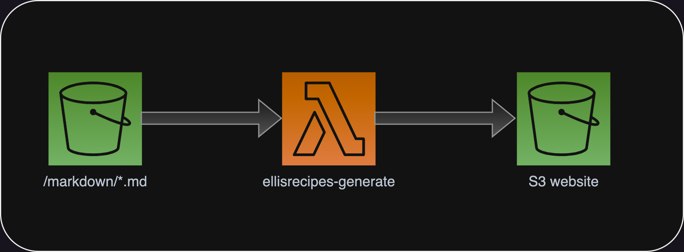

# Structure

All of the website files are located in the s3 folder, which should be put in an S3 bucket

There is one lambda function here, that will generate a new index.html based on all of the markdown files in the markdown directory of the s3 bucket you create

# Throwback

To when this was hosted on half a laptop in my basement

[django version](https://github.com/elliscode/ellisrecipes/tree/af8ad287b6a0f831802d51a1440a6f052906f3e1)